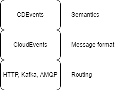

# 

CDEvents is a common specification for Continuous Delivery events, enabling
interoperability in the complete software production ecosystem.

It's an incubated project at the
[Continuous Delivery Foundation](https://cd.foundation) (CDF).

## Background
<!--
Resources used for the background text
https://cd.foundation/blog/2021/03/16/cd-foundation-announces-industry-initiative-to-standardize-events-from-ci-cd-systems/
https://github.com/cdfoundation/toc/blob/master/sigs/sig-events.md
https://github.com/cdfoundation/sig-events
https://github.com/cdfoundation/toc/blob/master/proposals/cdevents/cdevents.md
-->
In a complex and fast moving CI/CD world with a lot of different tools and
platform that need to communicate with each other interoperability stands as a
crucial thing. The maintainer of a CI/CD system needs to swap out tools in short
time with little to no stops.

The larger and more complex a CI/CD system becomes, challenges increase in
knowing how the tools communicate and what they do.

### What we provide

The CDEvents protocol defines a vocabulary of events enabling tools to
communicate in a interoperable way.

We extend other efforts such as CloudEvents by introducing purpose and semantics
meaning of an event.

We thus build on top of the work from other players as the following stack
pictures exemplifies.

By providing a interoperable way of tool to communicate we also provide means to
give an overview picture increasing observability, but also provides measuring
points for metrics.

#### How does it enable tools to communicate in a interoperable way?

By creating a language, we define how tools and services communicate with each
other about occurrences in a CI/CD system. As this language does not tie to a
specific tool it serves a neutral ground for communication.

Using this language we defining a set of events that has purpose and semantic
meaning. With this tools know what events to send and receivers know how to
interpret the information received. This enables tools to have a common
understanding of the information sent in the events.

The language enables creating an ecosystem of tools for monitoring, tracing,
measuring, and orchestrating using our events without having to write a
"plugin" for every tool.

#### Why use events?

Reading from the
[CloudEvents primer - design goals](https://github.com/cloudevents/spec/blob/v1.0.2/cloudevents/primer.md#design-goals)

> The goal of the CloudEvents specification is to define interoperability of
> event systems that allow services to produce or consume events, where the
> producer and consumer can be developed and deployed independently. A producer
> can generate events before a consumer is listening, and a consumer can express
> an interest in an event or class of events that is not yet being produced.

We believe that using events will lead to a more decoupled systems with services
and tools developed and deployed independently. This makes us agnostic of the
underlying infrastructure

#### Why not point-to-point communication?

We believe that using integrations based on point-to-point communication will
create a system that will:

* Not scale - when trying to add new consumers or senders each tools have to make
  an update
* Create a coupled architecture - using point-to-point communication creates a
  tightly intertwined architecture difficult to expand and monitor.

#### Why not webhooks?

We think
[webhooks](https://github.com/cloudevents/spec/blob/v1.0.2/cloudevents/http-webhook.md)
deliver value when used well but to define a system based on them would make it:

* Based on point-to-point communication
* Dependent on synchronous communication

## CDEvents Specification

The [CDEvents Specification](./spec.md) is available on our
[website](https://cdevents.dev/docs).

The specification is currently draft and not ready for implementation.
We are working towards our
[first release v0.1](https://github.com/orgs/cdevents/projects/1).

## CDEvents SDKs

CDEvents is developing as set of SDKs:

* [Go](https://github.com/cdevents/sdk-go)

## Community

### How to get involved

[Reach out](governance.md#project-communication-channels) to see what we're up
via:

* [slack](https://cdeliveryfdn.slack.com/archives/C030SKZ0F4K)
* [our mailing list](https://groups.google.com/g/cdevents-dev)
* [our working group meetings](https://calendar.google.com/event?action=TEMPLATE&tmeid=aWhyZjVwb3F2MnY2bml0anUyNDRvazdkdWpfMjAyMjAyMjJUMTYwMDAwWiBhbmRyZWEuZnJpdHRvbGlAbQ&tmsrc=andrea.frittoli%40gmail.com&scp=ALL)

### Contributing

If you would like to contribute, see our [contributing](https://github.com/cdevents/.github/blob/main/docs/CONTRIBUTING.md)
guidelines.

### Governance

The project has been started by the CDF
[SIG Events](https://github.com/cdfoundation/sig-events) and is currently
[governed](governance.md) by a few members of the SIG.
