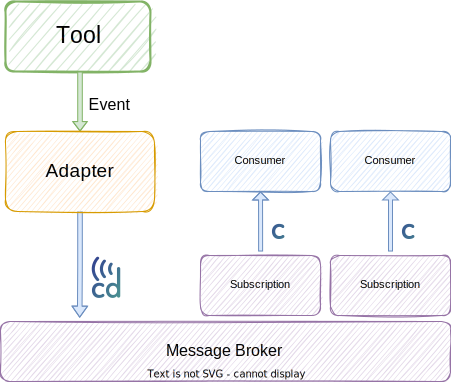
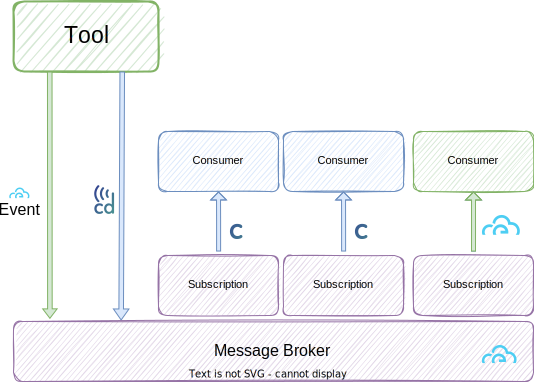
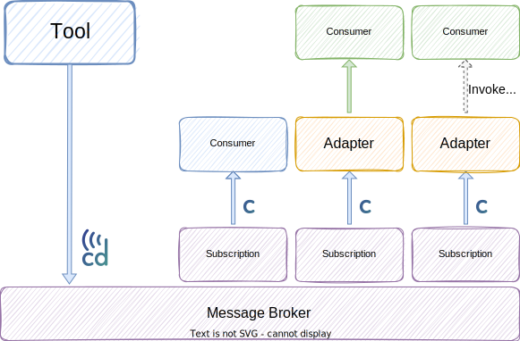
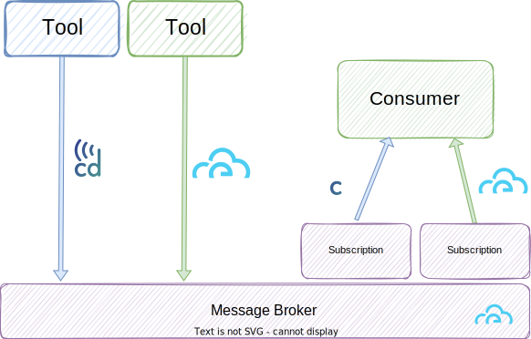

<!--
---
linkTitle: "Primer"
weight: 20
description: >
    A CDEvents primer
---
-->
# CDEvents Primer

## Abstract

This non-normative document provides an overview of the CDEvents specification.
It is meant to complement the CDEvents specification to provide additional
background and insight into the history and design decisions made during the
development of the specification. This allows the specification itself to focus
on the normative technical details.

When new features are added to the CDEvents specification, the CDEvents primer
document is updated accordingly to reflect the design decisions behind the change.

## Table of Contents

<!-- toc -->
- [History](#history)
- [Design reflections](#design-reflections)
  - [How does CDEvents enable tools to communicate in an interoperable way?](#how-does-cdevents-enable-tools-to-communicate-in-an-interoperable-way)
  - [Why use events?](#why-use-events)
  - [Why not point-to-point communication?](#why-not-point-to-point-communication)
  - [Declarative vs. imperative events](#declarative-vs-imperative-events)
- [Relations to CloudEvents](#relations-to-cloudevents)
- [Versioning](#versioning)
  - [Versioning of CDEvents](#versioning-of-cdevents)
  - [Versioning of the CDEvents specification](#versioning-of-the-cdevents-specification)
  - [Development of a new version](#development-of-a-new-version)
- [Extending CDEvents](#extending-cdevents)
  - [Adding new data to CDEvents](#adding-new-data-to-cdevents)
  - [Adding new event types](#adding-new-event-types)
- [Adopting CDEvents](#adopting-cdevents)
  - [Producer-side architectures](#producer-side-architectures)
    - [External event producer](#external-event-producer)
    - [External event adapter](#external-event-adapter)
    - [Multiple event formats produced](#multiple-event-formats-produced)
  - [Consumer-side architectures](#consumer-side-architectures)
    - [Multiple event formats through adapter](#multiple-event-formats-through-adapter)
    - [Consumer-side adapters](#consumer-side-adapters)
    - [Multiple event formats consumed](#multiple-event-formats-consumed)
- [Acknowledgments](#acknowledgments)
- [Use Cases](#use-cases)
- [Design Decisions](#design-decisions)
  - [Keys, Values and Types](#keys-values-and-types)
  - [Simplified data model](#simplified-data-model)
  - [Artifacts](#artifacts)
- [Whitepaper](#whitepaper)
<!-- /toc -->

## History

The [Events in CI/CD Workstream][workstream] was originally formed by the [CDF
Interoperability Special Interest Group][sig-interop] with the mission to
*Standardize events to be used in a CI/CD process*. The workstream later evolved
into [Event Special Interest Group][sig-events], which defined the initial
vocabulary for CI/CD events, developed a golang SDK and a first proof of concept
which involved [Tekton](https://tekton.dev) and [keptn](https://keptn.sh).

The initial vocabulary then became [CDEvents](https://cdevents.dev), a new
standalone [CDF](https://cd.foundation) incubated project.

## Design reflections

### How does CDEvents enable tools to communicate in an interoperable way?

By creating a language, we define how tools and services communicate with each
other about occurrences in a CI/CD system. As this language does not tie to a
specific tool it serves a neutral ground for communication.

Using this language we define a set of events with purpose and semantic meaning.
With such a well-defined language, tools know what events to send, and receivers
know how to interpret the information received. This enables tools to have a
common understanding of the information sent in the events.

The language enables creating an ecosystem of tools for monitoring, tracing,
measuring, and orchestrating using our events without having to write a "plugin"
for every tool.

### Why use events?

Reading from the [CloudEvents primer - design goals][ce-design-goals]

> The goal of the CloudEvents specification is to define interoperability of
> event systems that allow services to produce or consume events, where the
> producer and consumer can be developed and deployed independently. A producer
> can generate events before a consumer is listening, and a consumer can express
> an interest in an event or class of events that is not yet being produced.

We believe that using events will lead to a more decoupled systems with services
and tools developed and deployed independently. This makes us agnostic of the
underlying infrastructure

### Why not point-to-point communication?

We believe that using integrations based on point-to-point communication will
create a system that will:

* Not scale - when trying to add new consumers or producers each tool have to
  make an update
* Create a coupled architecture - using point-to-point communication creates a
  tightly intertwined architecture difficult to expand and monitor.

### Declarative vs. imperative events

CDEvents are declarative events. With "declarative" we refer to event through
which the producer sends information about an occurrence, but it does not know
how the event will be used on the receiving side or even who will receive it.

With imperative events we refer to events that are sent with the intent of
triggering a specific reaction, like "start a pipeline" or "deploy an
application". CDEvents do not support imperative events today; the specification
may include imperative events in future to foster interoperability in systems
that rely on imperative events today.

Imperative events create coupling between producer and consumer as they
typically require some form of acknowledgement to be send back by the
consumer of the original event back to the producer. Imperative events are
useful to implement workflows where the orchestration logic is centrally
managed by a single component.

A behavior similar to that of imperative events can be achieved by moving part
of the business logic to an adapter that listens for specific declarative events
and decides based on a set of policy to trigger actions in a downstream system,
similarly to what is described in the [receiving
adapters](#consumer-side-adapters) scenario.

## Relations to CloudEvents

CDEvents defines a [specification](./cloudevents-binding.md) that provides a set
of JSON object schemas (one for each event type, covering mandatory and optional
attributes etc.)

When used with CloudEvents, CDEvents passes the JSON schema  via the
[`dataschema`](https://github.com/cloudevents/spec/blob/v1.0.1/spec.md#dataschema)
attribute and provide the corresponding JSON object through the
[`data`](https://github.com/cloudevents/spec/blob/v1.0.1/spec.md#event-data)
attribute.

CDEvents aims to use existing CloudEvents extension attributes (e.g.
`partitionkey` from the [Partitioning][ce-partitioning] extension) before
defining its own extensions. When no appropriate extension attributes exists,
CDEvents aims to make an official CloudEvents extension for the CloudEvents
specification and listed with other [documented
extensions](https://github.com/cloudevents/spec/blob/v1.0.1/documented-extensions.md).

## Versioning

The CDEvents specification and events are versioned independently, both
following the principle of semantic versioning.

### Versioning of CDEvents

Individual CDEvents are versioned using semantic versioning, with a
`major.minor.patch` format of the version.

Backward compatible changes are changes that allow existing consumers to parse
messages with a newer version, have access to the same data as before, as long
the extra fields are ignored. Broadening the accepted values for a property is a
backward incompatible change, as the consumer may not be prepared to manage the
new format of value.

Note that this means that consumers SHOULD be prepared to handle (and disregard)
unrecognized properties in higher minor versions than they are familiar with.

- Major versions (e.g. 0.3.1 -> 1.0.0): backward incompatible changes to events.
  Renamed, moved or removed fields requires a new major version.

- Minor versions (e.g. 0.1.2 -> 0.2.0): backward compatible changes to events
  that involve a structural change in the schema. A new field is added, a copy
  of an existing field is added and the old location deprecated, or a new

- Patch versions (e.g. 0.1.0 -> 0.1.1): backward compatible changes to events
  that do not involve any structural change in the schema, for instance
  narrowing the accepted values for a property

While the specification of an event is work in progress, its version is tagged
with an extra `-draft` at the end.

The version of an event is included in its type. This allows for easy filtering
of events of a specific version, by looking at a single field in the context.
Examples of full event versions are:

- `dev.cdevents.build.queued.0.1.0`
- `dev.cdevents.environment.deleted.0.1.0`

### Versioning of the CDEvents specification

The overall CDEvents specification is versioned using semantic versioning, with
a `major.minor.patch` format of the version. The specification version is
associated to a git version (tag) in the `cdevents/spec` repository, in the
format `vMajor.Minor.Patch`.

- A specification that includes only cosmetic fixes is identified by a change in
  the patch version, for instance 0.1.0 -> 0.1.1

- A specification that includes only backwards compatible change is identified
  by a change in the minor version, for instance 0.1.3 -> 0.2.0

- A specification that includes at least one backward incompatible change, is
  identified by a change in the major version, for instance 0.1.2 -> 2.0.0

While a version of the specification is work in progress, its version is tagged
with an extra `-draft` at the end, for instance 0.1.0.

### Development of a new version

The specification on the main branch is versioned with the number of the next
version followed by a `-draft`. If any event is modified, its version is changed
accordingly, followed by a `-draft` as well.

Once a specification is ready for release, its number if updated, the event versions
are finalized (`-draft` is removed), schemas are updated and a git tag is created for
this last commit.

## Extending CDEvents

The CDEvents specification is designed to evolve over time, to accommodate the
need of CDEvents users and cover a growing number of use cases.
In all cases we prefer backward compatible changes, which could be new fields in
existing events or new event types.
[Versioning](#versioning) of messages is used for producers to validate messages
before they are sent, and for consumer to know how to parse them.

### Adding new data to CDEvents

If the data model of a CDEvent is not sufficient, events producers may choose to
pass extra data through the `customData` field. Using `customData` can be an
effective interim step, as it's easy to implement and can be used to help the
migration process from existing events to CDEvents.

In most cases though `customData` should not be considered as a permanent
solution, since consumers don't know how to process this extra data, unless they
implement producer specific logic and sacrifice part of the interoperability
benefit of using CDEvents.

Adding a new field to an existing CDEvent type is considered a backward
compatible change - see the [versioning](#versioning) for more details.
Aspects to consider when proposing a new field are:

- is the field generally useful to the CD community? Data that is unique to a
  single platform is likely to be rejected
- what are the use cases where this field will be used?
- what is the format for the new field? Please be as specific as possible
- what is the name of the new field? Check the [SIG interoperability
  vocabulary][sig-interop-vocabulary] if a standard name exists. If not
  propose the new field name for the vocabulary as well.

### Adding new event types

If a new event type is needed, it's good practice to contribute the new type
into the CDEvents specification. Custom events can be used, but they should not
use the "dev.cdevents" namespace for their type.

Custom events are not interoperable, so existing CDEvents consumers won't be
able to handle them. Introducing a custom event is simple enough on the producer
side but it doesn't scale well with the number of consumers.

Adding a new event to an existing CDEvents bucket is a backward compatible
change. Aspects to consider when proposing a new event type are:

- is the event generally useful to the CD community? Events that are very
  specific to a single platform are likely to be rejected. If the event
  represents a functionality that is currently only implemented in one platform,
  but nonetheless generally useful, it can still be introduced in CDEvents
- what are the use cases where this event will be used?
- what are the sources of these events?
- if the event includes a new kind of subject, what is the data model of the
  subject? What is the format of its ID? Please be as specific as possible
- what is the name of the new type? Check the [SIG interoperability
  vocabulary][sig-interop-vocabulary] if a standard name exists. If not
  consider proposing the new field name for the vocabulary as well.

## Adopting CDEvents

When adopting CDEvents, producers and consumers alike may adopt different
strategies to support existing event producers and consumers that want to
consider existing messaging systems, formats and event producers and consumers
that are in place.
CDEvents is a new specification, but neither CloudEvents nor events in general
are a new idea, and several tools may already be using events or webhooks with a
tool specific data model.

Below we consider a set of common scenarios and how CDEvents may be
incrementally introduced in an existing system.

### Producer-side architectures

In the first three scenarios, CDEvents are introduced in the producer side,
either directly in the tool or through some external component.

#### External event producer

If a tool does not produce events, it may be possible to use an external
component to "watch" a tool output (for instance logs) and produce CDEvents.

If the output does not contain all information required for the events, this
limitation can be worked-around by adding the missing data in the tool output.

This solution may be brittle, because the tool output may not be a stable
interface for the tool, and it may change over time without notice.

This approach is certainly valid to build a proof-of-concept or to experiment
with events in an existing environment.

If the output of the tool is structured and part of the tool API, this may also
be adopted as a permanent solution, to keep separation of concerns between the
tool itself and the process of generating events.

#### External event adapter

If a tool does produce events, it may be possible to use an external adapter
component to convert the existing events into CDEvents.

Similar to the [previous case](#external-event-producer), incoming events may be
missing data required by CDEvents. If the events come from a tool that we do not
control, we cannot alter the content of the events, so we may request the tool
maintainers to either add the extra data or, like in the next scenario, start
producing CDEvents natively.

#### Multiple event formats produced

A tool may start producing CDEvents natively. If the tool previously produced
events, some consumers may expect the pre-existing event format. This can be
solved on the producer side by sending both format of events in parallel.

In some cases it may be possible to use a single broker for both event types,
for instance if both formats are CloudEvents based.

### Consumer-side architectures

Typically it won't be possible for all existing event consumers to switch to
CDEvents at the same time. The following scenarios show how an incremental
approach can be used to migrate consumers towards CDEvents gradually.

#### Multiple event formats through adapter

In a variation of the previously mentioned producer-side architectures, the tool
produces only one format of events, which is sent to the broker. The adapter
subscribes to the events, converts them and publishes them back to the broker.
Consumer may then subscribe to the type of events that they prefer.

With this architecture, the adapter may even be able to convert messages from
different tools, instead of just one.

#### Consumer-side adapters

In this scenario, the tool and some consumers use CDEvents. New consumers are
added that do not understand CDEvents, or that do not support events in general.
An adapter can be used to convert a CDEvent into the consumer specific format or
to extract data from a CDEvent and use it to invoke an API for the receiving
side.

#### Multiple event formats consumed

In this scenario, a new tool is added that produces CDEvents. An existing
consumer wants to benefit from existing events as well as the events from the
new tool.

A single consumer may receive events from heterogenous sources.

## Acknowledgments

The initial structure of the CDEvents specification format was based on the
specification of the [CloudEvents](https://github.com/cloudevents/spec) project.

## Use Cases

There are two root use cases that we are considering:

- *Interoperability through CDEvents*: In this use case, platforms from the CD
  landscape either produce or consume CDEvents. On the producing side, a system
  broadcasts that certain value has been produced, like a code change, an
  artifact or a test result. On the consumer-side, a system takes an action that
  takes advantage of that value that has been produced.

- *Observability & Metrics*: In this use case, platforms from the CD landscape
  produce CDEvents that describe the start and end of parts of an end of end CD
  workflow, for instance build started and finished, artifact packaged and
  published and deployment started and finished. We want to visualize the end to
  end CD workflow, for instance from a change being written, through its build,
  test, release, deployment and possibly rollback in case a remediation is
  required. To achieve that, events are sent to an event router and collected by
  a pipeline visualization application, that uses the information in the events
  to correlate them with each other and build an end to end view. With the same
  events, we want to measure DevOps performance as well. The same events can be
  used to track different metrics over time, to be visualized through a
  dashboard. The current events provide enough data to calculate two of the four
  [DORA DevOps metrics][dora]:

  - Lead time for changes: the amount of time it takes a commit to get into production
  - Deployment frequency: how often an organization successfully releases to production

## Design Decisions

### Keys, Values and Types

The CDEvents specification defines event types, keys and, for ENUM types,
values.

Event types are defined as all lowercase, separated by dots. The first part of
each type is always "dev.cdevents" which is the reverse DNS domain of the
CDEvents project.

Keys and ENUM values are always written in
[lowerCamelCase](https://en.wikipedia.org/wiki/Camel_case) for readability
purposes.

### Simplified data model

In the initial version of CDEvents we tackled a simple scenario in which
each artifact is built from a single repository and each service is deployed
from a single artifact.

This data model is somewhat limited, but is has allowed us to put more focus
on the overall structure of the protocol in the first release.

We plan to extend the data model to support more complex scenarios in upcoming
releases.

### Artifacts

The specification has chosen for v0.1.0 to adopt [package-urls][purl] (or purls)
as the format for any artifact identifier included in the spec. Purls provide a
consistent format for artifact identifiers across different package types.

CDEvents wishes for a format that can be used to reference to an artifact, or
package, that is independent from the hosting storage, which is a property which
purls satisfy for several artifact types.

## Whitepaper

The [CDEvents whitepaper](./CDEvents_Whitepaper.pdf) has been originally
[published][whitepaper] on June 7, 2022 on the CDF blog. It is intended for an
audience of DevOps Engineers, Project Managers/Directors, CTOs, and Cloud
Architects who are interested in learning more about CDEvents, why it was
created and its mission.

[workstream]: https://github.com/cdfoundation/sig-interoperability/tree/master/workstreams/archived/events_in_cicd
[sig-interop]: https://github.com/cdfoundation/sig-interoperability
[sig-events]: https://github.com/cdfoundation/sig-events/
[whitepaper]: https://cd.foundation/blog/2022/06/07/cdevents-publishes-first-whitepaper/
[ce-design-goals]: https://github.com/cloudevents/spec/blob/v1.0.2/cloudevents/primer.md#design-goals
[ce-partitioning]: https://github.com/cloudevents/spec/blob/v1.0.1/extensions/partitioning.md
[purl]:
    https://github.com/package-url/purl-spec/blob/master/PURL-SPECIFICATION.rst
[sig-interop-vocabulary]:
    https://github.com/cdfoundation/sig-interoperability/blob/main/docs/vocabulary.md
[dora]: https://cloud.google.com/blog/products/devops-sre/using-the-four-keys-to-measure-your-devops-performance